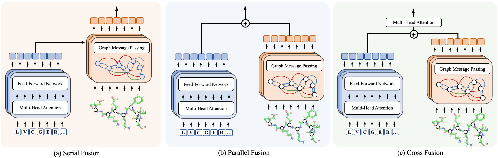
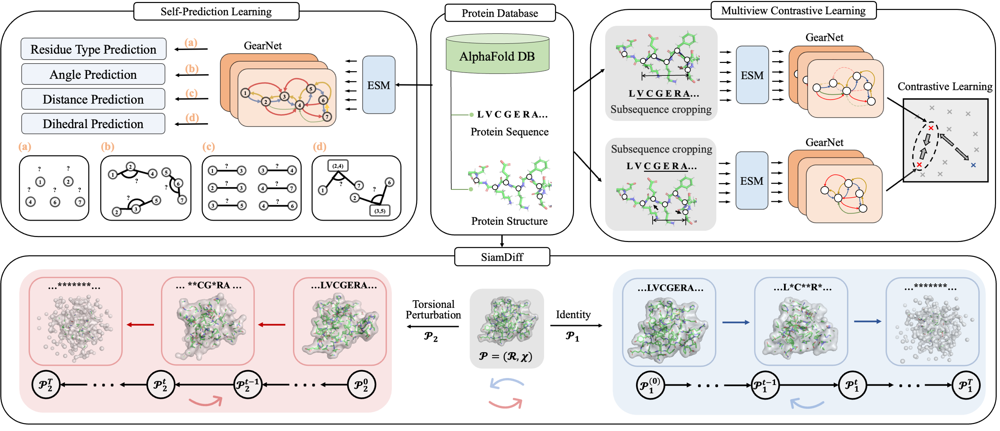

# ESM-GearNet


This is the official codebase of the paper

**A Systematic Study of Joint Representation Learning on Protein Sequences and Structures** 
[[ArXiv](https://arxiv.org/abs/2303.06275)]

[Zuobai Zhang](https://oxer11.github.io/), [Chuanrui Wang*](https://wang-cr.github.io/), [Minghao Xu*](https://chrisallenming.github.io/), [Vijil Chenthamarakshan](https://researcher.watson.ibm.com/researcher/view.php?person=us-ecvijil), [Aurelie Lozano](https://researcher.watson.ibm.com/researcher/view.php?person=us-aclozano), [Payel Das](https://researcher.watson.ibm.com/researcher/view.php?person=us-daspa), [Jian Tang](https://jian-tang.com/)


## Overview

To explore the advantage of combining the advantages of sequence- and structure-based protein encoders, we conduct a comprehensive investigation into joint protein representation learning.
Our study combines a state-of-the-art PLM (ESM-2) with three distinct structure encoders ([GVP](https://openreview.net/forum?id=1YLJDvSx6J4), [GearNet](https://openreview.net/forum?id=to3qCB3tOh9), and [CDConv](https://openreview.net/forum?id=P5Z-Zl9XJ7)). 
We introduce three fusion strategies—serial, parallel, and cross fusion—to combine sequence and structure representations.



We further explore six diverse pre-training techniques: ([Residue Type Prediction](https://arxiv.org/abs/2203.06125), [Distance Prediction](https://arxiv.org/abs/2203.06125), [Angle Prediction](https://arxiv.org/abs/2203.06125), [Dihedral Prediction](https://arxiv.org/abs/2203.06125), [Multiview Contrast](https://arxiv.org/abs/2203.06125), [SiamDiff](https://arxiv.org/abs/2301.12068)), employing the optimal model from the aforementioned choices and leveraging pre-training on the AlphaFold Database.



You can find the pre-trained model weights here, including ESM-GearNet pre-trained with [Multiview Contrast](), [Residue Type Prediction](), [Distance Prediction](), [Angle Prediction](), [Dihedral Prediction]() and [SiamDiff]().


## Installation

You may install the dependencies via either conda or pip. Generally, ESM-GearNet works
with Python 3.7/3.8 and PyTorch version >= 1.12.0.

### From Conda

```bash
conda install torchdrug pytorch=1.12.1 cudatoolkit=11.6 -c milagraph -c pytorch-lts -c pyg -c conda-forge
conda install easydict pyyaml -c conda-forge
conda install transformers==4.14.1 tokenizers==0.10.3 -c huggingface 
pip install atom3d
```

### From Pip

```bash
pip install torch==1.12.1+cu116 -f https://download.pytorch.org/whl/lts/1.12/torch_lts.html
pip install torchdrug
pip install easydict pyyaml
pip install atom3d
pip install transformers==4.14.1 tokenizers==0.10.3
```

## Reproduction

### Training From Scratch

To reproduce the results of ESM-{GVP, GearNet, CDConv}, use the following command. 
Alternatively, you may reset the `gpus` parameter in configure files to switch to other GPUs. All the datasets will be automatically downloaded in the code. 
It takes longer time to run the code for the first time due to the preprocessing time of the dataset.


```bash
# Run ESM-GearNet (serial fusion) on the Enzyme Comission dataset with 4 gpus
python -m torch.distributed.launch --nproc_per_node=4 script/downstream.py -c config/EC/esm_gearnet.yaml

# ESM-GearNet (parallel fusion)
python -m torch.distributed.launch --nproc_per_node=4 script/downstream.py -c config/EC/esm_gearnet_parallel.yaml

# ESM-GearNet (cross fusion)
python -m torch.distributed.launch --nproc_per_node=4 script/downstream.py -c config/EC/esm_gearnet_cross.yaml

# Run ESM-GearNet (serial fusion) on the Gene Ontology dataset
python -m torch.distributed.launch --nproc_per_node=4 script/downstream.py -c config/GO/esm_gearnet.yaml --branch MF

# Run ESM-GearNet (serial fusion) on the PSR dataset
python -m torch.distributed.launch --nproc_per_node=4 script/downstream.py -c config/PSR/esm_gearnet.yaml --branch MF

# Run ESM-GearNet (serial fusion) on the MSP dataset
python -m torch.distributed.launch --nproc_per_node=4 script/downstream.py -c config/MSP/esm_gearnet.yaml --branch MF
```

### Pre-training and Fine-tuning
By default, we will use the AlphaFold Datase for pretraining. To pre-train ESM-GearNet with Multiview Contrast, use the following command. Similar, all the datasets will be automatically downloaded in the code and preprocessed for the first time you run the code.

```bash
# Run pre-training
python -m torch.distributed.launch --nproc_per_node=4 script/pretrain.py -c config/pretrain/mc_esm_gearnet.yaml
```

After pre-training, you can load the model weight from the saved checkpoint via the `--ckpt` argument and then finetune the model on downstream tasks.
**Remember to first uncomment the ``model_checkpoint: {{ ckpt }}` line in the config file.**

```bash
python -m torch.distributed.launch --nproc_per_node=4 script/downstream.py -c config/EC/esm_gearnet.yaml --ckpt <path_to_your_model>
```

## Citation
If you find this codebase useful in your research, please cite the following papers.

```bibtex
@article{zhang2023enhancing,
  title={A Systematic Study of Joint Representation Learning on Protein Sequences and Structures},
  author={Zhang, Zuobai and Wang, Chuanrui and Xu, Minghao and Chenthamarakshan, Vijil and Lozano, Aurelie and Das, Payel and Tang, Jian},
  journal={arXiv preprint arXiv:2303.06275},
  year={2023}
}
```
